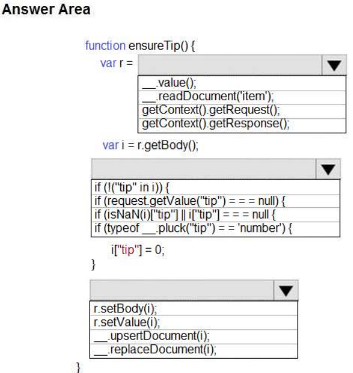
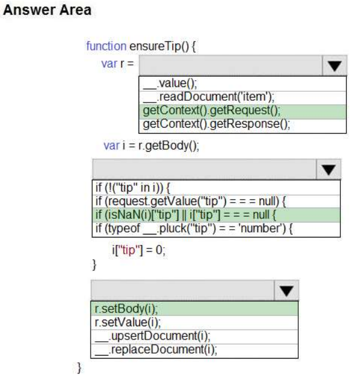

## Tema 1: Develop solutions that use Cosmos DB storage

- Preguntas:
  - **¿Qué es Azure Cosmos DB y qué ventajas ofrece como servicio de base de datos?**
  
    Azure Cosmos DB es un servicio de base de datos distribuido y globalmente escalable que ofrece una variedad de modelos de datos y garantiza un alto rendimiento, disponibilidad y escalabilidad. Con su capacidad de replicación y distribución global, permite a las aplicaciones acceder a los datos con baja latencia desde cualquier parte del mundo. Además, ofrece opciones de consistencia, alta disponibilidad, escalabilidad elástica y una estrecha integración con otros servicios de Azure, lo que lo convierte en una solución potente y versátil para satisfacer las necesidades de almacenamiento de datos de aplicaciones modernas.
  
  - **¿Cuáles son los modelos de datos compatibles con Azure Cosmos DB?**
  
    Azure Cosmos DB es compatible con varios modelos de datos, como documentos, grafos, clave-valor, columnares y tablas. Esto proporciona a los desarrolladores una gran flexibilidad para elegir el modelo de datos más adecuado según las necesidades de sus aplicaciones. Pueden almacenar y consultar datos en formato JSON sin esquema fijo, representar y consultar relaciones complejas entre entidades, utilizar claves únicas para un acceso rápido a datos específicos, aprovechar la compresión de datos y consultas analíticas eficientes, o utilizar una estructura de tabla similar a las bases de datos relacionales tradicionales. La compatibilidad con múltiples modelos de datos permite a los desarrolladores diseñar soluciones escalables y versátiles que se adapten a diversos casos de uso y requisitos de aplicaciones.
  
  - **¿Cómo se accede y se realiza consultas a una base de datos de Cosmos DB en Azure?**
  
    Para acceder y realizar consultas a una base de datos de Azure Cosmos DB en Azure, primero debes crear una instancia de Azure Cosmos DB y obtener las credenciales de conexión. Luego, elige una biblioteca de cliente compatible con tu lenguaje de programación preferido y configura la conexión utilizando las credenciales obtenidas. A través de la biblioteca de cliente, puedes utilizar el lenguaje de consulta correspondiente al modelo de datos seleccionado, como SQL-like para documentos o Gremlin para grafos, para realizar consultas y manipular los datos en la base de datos. Procesa los resultados obtenidos de las consultas de acuerdo con las necesidades de tu aplicación. Es importante seguir las mejores prácticas de programación y seguridad para garantizar un uso eficiente y seguro de Azure Cosmos DB en tu aplicación.
  
- Identificar y explicar (comprobar si es posible) de la bateria de Preguntas 3 preguntas por cada integrante relacionadas con Azure Cosmos DB storage.
  - **QUESTION 7, PÁGINA 89:**
  
    **You are developing an Azure Cosmos DB solution by using the Azure Cosmos DB SQL API. The data includes millions of documents. Each document may contain hundreds of properties.** 
  
    **The properties of the documents do not contain distinct values for partitioning. Azure Cosmos DB must scale individual containers in the database to meet the performance needs of the application by spreading the workload evenly across all partitions over time.** 
  
    **You need to select a partition key.**
  
    **Which two partition keys can you use? Each correct answer presents a complete solution.** 
  
    NOTE: Each correct selection is worth one point. 
  
    A. a single property value that does not appear frequently in the documents 
  
    B. a value containing the collection name 
  
    C. a single property value that appears frequently in the documents 
  
    D. a concatenation of multiple property values with a random suffix appended 
  
    E. a hash suffix appended to a property value 
  
    Respuesta correcta: DE 
  
    **Explicación:** 
  
    Puedes formar una clave de partición concatenando múltiples valores de propiedad en una sola propiedad de partición artificial llamada "partitionKey". Estas claves se conocen como claves sintéticas.
  
    Otra estrategia posible para distribuir la carga de trabajo de manera más uniforme es agregar un número aleatorio al final del valor de la clave de partición. Al distribuir los elementos de esta manera, puedes realizar operaciones de escritura paralelas en las particiones.
  
    Nota: Es una buena práctica tener una clave de partición con muchos valores distintos, como cientos o miles.
  
    El objetivo es distribuir tus datos y carga de trabajo de manera uniforme entre los elementos asociados con estos valores de clave de partición. Si no existe una propiedad así en tus datos, puedes construir una clave de partición sintética.
  
  - **QUESTION 13, PÁGINA 153:**
  
    **You are developing a Java application that uses Cassandra to store key and value data. You plan to use a new Azure Cosmos DB resource and the Cassandra API in the application. You create an Azure Active Directory (Azure AD) group named Cosmos DB Creators to enable provisioning of Azure Cosmos accounts, databases, and containers.** 
  
    **The Azure AD group must not be able to access the keys that are required to access the data.** 
  
    **You need to restrict access to the Azure AD group.** 
  
    **Which role-based access control should you use?** 
  
    A. DocumentDB Accounts Contributor 
  
    B. Cosmos Backup Operator 
  
    C. Cosmos DB Operator 
  
    D. Cosmos DB Account Reader 
  
    Respuesta correcta: C
  
    **Explicación:** 
  
    Azure Cosmos DB ahora ofrece un nuevo rol de RBAC, Operador de Cosmos DB. Este nuevo rol te permite aprovisionar cuentas de Azure Cosmos, bases de datos y contenedores, pero no puede acceder a las claves que se requieren para acceder a los datos. Este rol está destinado para su uso en escenarios donde se necesita la capacidad de otorgar acceso a los principios de servicio de Azure Active Directory para administrar las operaciones de implementación de Cosmos DB, incluyendo la cuenta, la base de datos y los contenedores.
  
  - **QUESTION 17, PÁGINA 41:**
  
    **HOTSPOT** 
  
    **You have a web service that is used to pay for food deliveries. The web service uses Azure Cosmos DB as the data store.**
  
    **You plan to add a new feature that allows users to set a tip amount. The new feature requires that a property named tip on the document in Cosmos DB must be present and contain a numeric value.** 
  
    **There are many existing websites and mobile apps that use the web service that will not be updated to set the tip property for some time.** 
  
    **How should you complete the trigger?** 
  
    NOTE: Each correct selection is worth one point. 
  
    Hot Area:
  
    
  
    Respuesta correcta:
  
    
  
    **Explicación:**
    