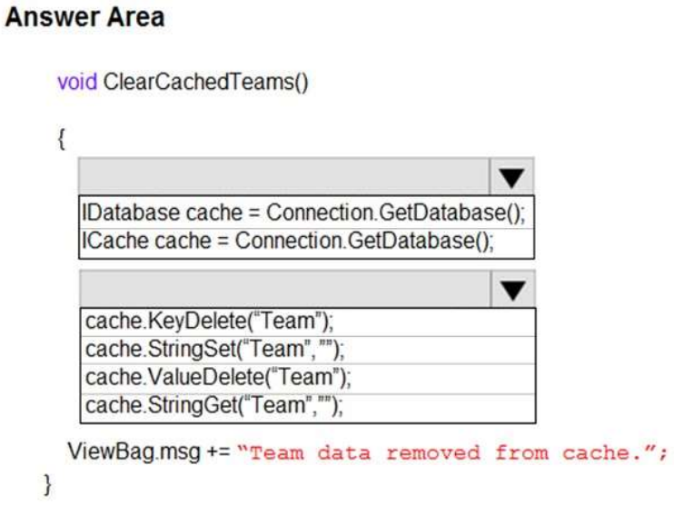
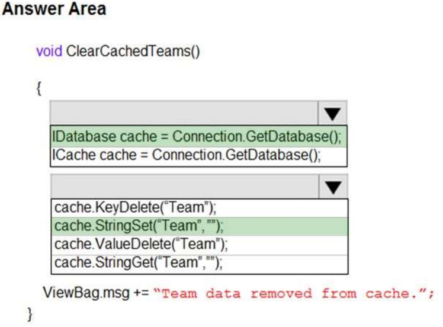

## Tema 7: Implement caching for solutions

- Preguntas:
  - **¿Qué es la caché y cómo puede mejorar el rendimiento de una aplicación?**
  
    La caché es una técnica que almacena temporalmente datos o resultados de operaciones costosas en una memoria más rápida, lo que puede mejorar significativamente el rendimiento de una aplicación. Al guardar copias de datos previamente solicitados, se reduce la carga en los recursos subyacentes y se acelera la respuesta de la aplicación. Esto mejora la velocidad de acceso a los datos, reduce el tráfico de red y aumenta la escalabilidad al permitir manejar más solicitudes concurrentes. Sin embargo, es importante gestionar adecuadamente la caché, garantizar la coherencia de los datos almacenados y establecer estrategias de invalidación y actualización para mantener la precisión de la información en caché.
  
  - **¿Cuáles son las opciones de caché disponibles en Azure?**
  
    Azure ofrece varias opciones de caché para mejorar el rendimiento de las aplicaciones. Una de las opciones más populares es Azure Cache for Redis, que proporciona almacenamiento en memoria de alto rendimiento y escalabilidad. También está disponible Azure Content Delivery Network (CDN), que almacena en caché contenido estático para una entrega rápida a los usuarios finales. Azure SQL Database Elastic Query Cache permite almacenar en caché resultados de consultas para acelerar consultas repetitivas. Azure Managed Disks Cache mejora el rendimiento de las máquinas virtuales al almacenar en caché datos de discos administrados. Además, Azure Application Gateway Cache permite almacenar en caché contenido web estático y dinámico en el nivel de la aplicación. Estas opciones de caché ofrecen diferentes características y beneficios, lo que te permite seleccionar la opción más adecuada según tus necesidades y requisitos de rendimiento.
  
  - **¿Cómo se implementa y se utiliza la caché en una solución en Azure?**
  
    Para implementar y utilizar la caché en una solución en Azure, primero selecciona la opción de caché adecuada según tus necesidades de rendimiento. Luego, crea e implementa la instancia de caché en Azure, configurando las propiedades y asignando los recursos necesarios. Asegúrate de integrar correctamente la caché con tu solución en Azure, configurando las rutas y reglas de caché correspondientes. En tu aplicación, utiliza la API o bibliotecas específicas para interactuar con la caché, almacenando y recuperando datos de manera apropiada. Realiza un monitoreo constante del rendimiento de la caché y ajusta su configuración según sea necesario. Es importante seguir las mejores prácticas, utilizar herramientas de supervisión y considerar las necesidades específicas de tu aplicación para optimizar el uso de la caché en Azure.
  
- Identificar y explicar (comprobar si es posible) de la batería de Preguntas 3 preguntas por cada integrante relacionadas con Azure Cache for Redis.
  - **QUESTION 12, PÁGINA 203:**
  
    **HOTSPOT** 
  
    **A company is developing a gaming platform. Users can join teams to play online and see leaderboards that include player statistics. The solution includes an entity named Team.**
  
    **You plan to implement an Azure Redis Cache instance to improve the efficiency of data operations for entities that rarely change.** 
  
    **You need to invalidate the cache when team data is changed.** 
  
    **How should you complete the code? To answer, select the appropriate options in the answer area.** 
  
    NOTE: Each correct selection is worth one point. 
  
    Hot Area:
  
    
  
    Respuesta correcta:
  
    
  
    **Explicación:** 
  
    Box 1: IDatabase cache = connection.GetDatabase(); 
  
    Connection se refiere a un ConnectionMultiplexer previamente configurado.  
  
    Box 2: cache.StringSet("teams",") 
  
    Para especificar la caducidad de un elemento en la caché, utiliza el parámetro TimeSpan de StringSet.
  
    cache.StringSet("key1", "value1", TimeSpan.FromMinutes(90)); 
  
    **QUESTION 1, PÁGINA 191:**
  
    Note: This question is part of a series of questions that present the same scenario. Each question in the series contains a unique solution. Determine whether the solution meets the stated goals. 
  
    **You are developing and deploying several ASP.NET web applications to Azure App Service. You plan to save session state information and HTML output.** 
  
    **You must use a storage mechanism with the following requirements:** 
  
    - **Share session state across all ASP.NET web applications.** 
    - **Support controlled, concurrent access to the same session state data for multiple readers and a single writer.** 
    - **Save full HTTP responses for concurrent requests.** 
  
    **You need to store the information.** 
  
    **Proposed Solution: Deploy and configure Azure Cache for Redis. Update the web applications.** 
  
    **Does the solution meet the goal?** 
  
    **A. Yes** 
  
    **B. No** 
  
    Respuesta correcta: A 
  
    **Explicación:** 
  
    El proveedor de estado de sesión para Azure Cache for Redis te permite compartir información de sesión entre diferentes instancias de una aplicación web ASP.NET.
  
    La misma conexión puede ser utilizada por múltiples hilos concurrentes.
  
    Redis admite operaciones de lectura y escritura.
  
    El proveedor de caché de salida para Azure Cache for Redis te permite guardar las respuestas HTTP generadas por una aplicación web ASP.NET.
  
    Nota: Usando el portal de Azure, también puedes configurar la política de eliminación de la caché y controlar el acceso a la caché agregando usuarios a los roles proporcionados. Estos roles, que definen las operaciones que los miembros pueden realizar, incluyen Propietario, Colaborador y Lector. Por ejemplo, los miembros del rol de Propietario tienen control completo sobre la caché (incluida la seguridad) y su contenido, los miembros del rol de Colaborador pueden leer y escribir información en la caché, y los miembros del rol de Lector solo pueden recuperar datos de la caché.  
  
  - **QUESTION 10, PÁGINA 202:**
  
    Note: This question is part of a series of questions that present the same scenario. Each question in the series contains a unique solution. Determine whether the solution meets the stated goals. 
  
    **You are developing and deploying several ASP.NET web applications to Azure App Service. You plan to save session state information and HTML output.** 
  
    **You must use a storage mechanism with the following requirements:** 
  
    - **Share session state across all ASP.NET web applications.** 
    - **Support controlled, concurrent access to the same session state data for multiple readers and a single writer.** 
    - **Save full HTTP responses for concurrent requests.**
  
    **You need to store the information.** 
  
    **Proposed Solution: Enable Application Request Routing (ARR).** 
  
    **Does the solution meet the goal?** 
  
    **A. Yes** 
  
    **B. No** 
  
    Correct Answer: B 
  
    **Explicación:** 
  
    ARR es una herramienta que proporciona capacidades de equilibrio de carga y proxy inverso para optimizar la distribución del tráfico y mejorar el rendimiento de las aplicaciones web en Azure. En su lugar, implementa y configura Azure Cache for Redis. Actualiza las aplicaciones web. 
